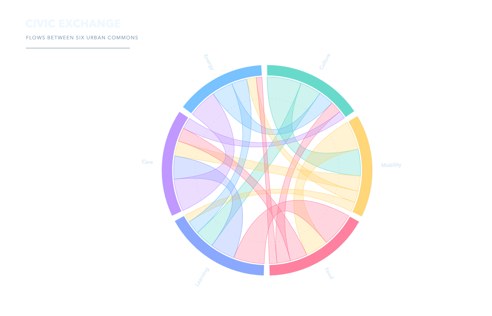
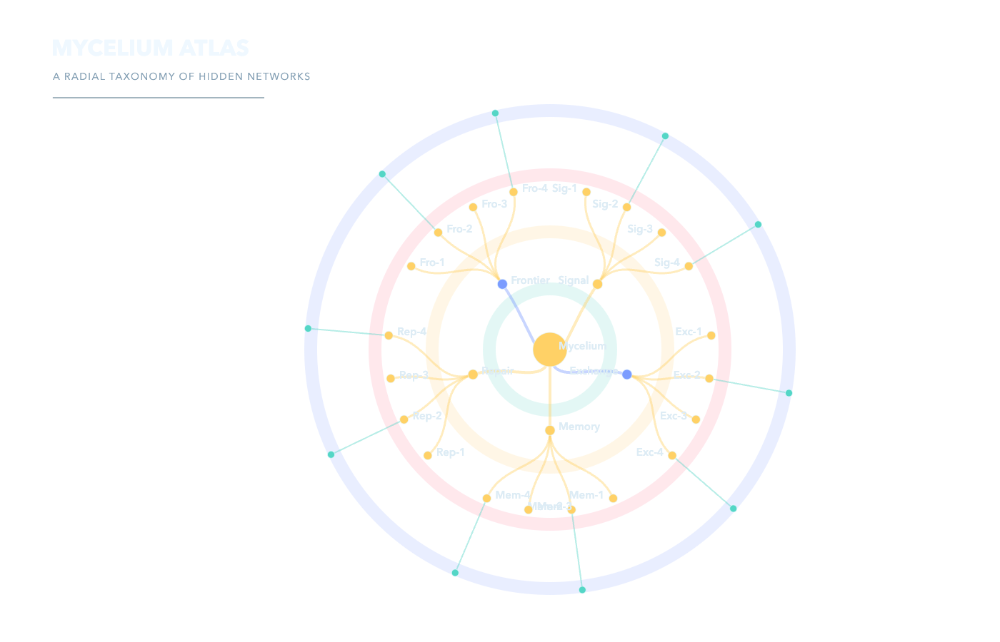
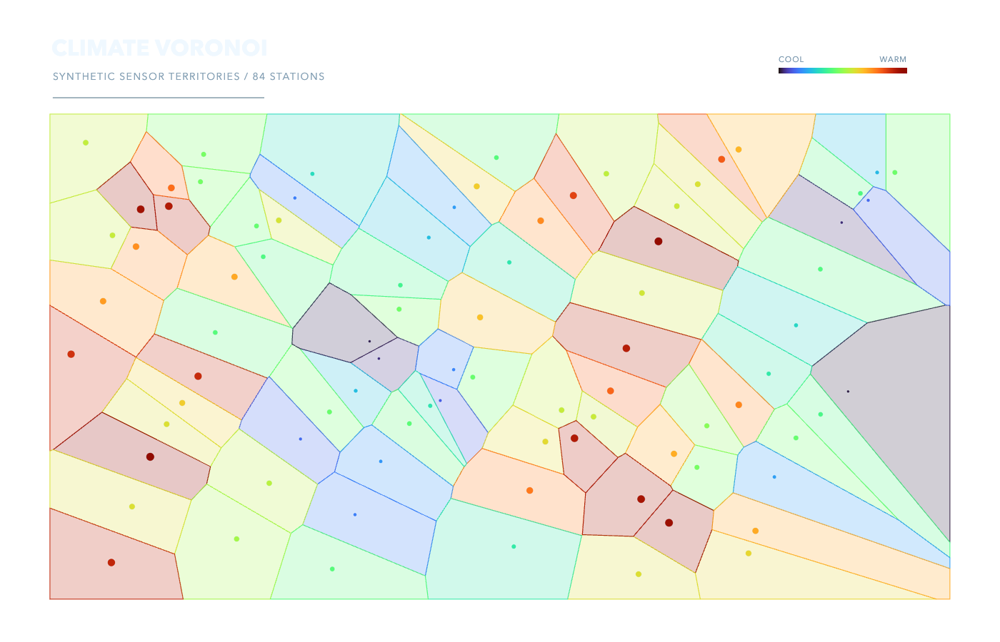

# D3 Visuals

D3 is used here as a geometry and layout toolkit, not a preset chart catalog.

| Scene | Preview | Core modules |
|---|---|---|
| Civic exchange chord |  | `d3-chord`, ribbons, arcs |
| Mycelium radial tree |  | `d3-hierarchy`, radial links |
| Climate Voronoi atlas |  | Delaunay/Voronoi, scales |

`npm install && npm test` performs the full build, offline browser interaction, transparent export, and pixel acceptance pass.
