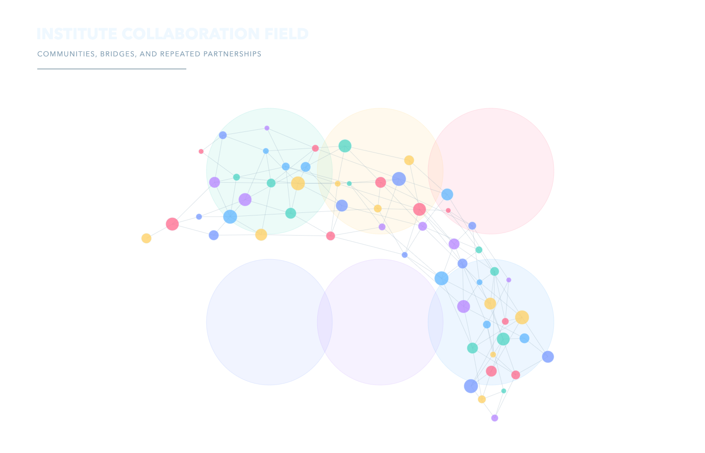
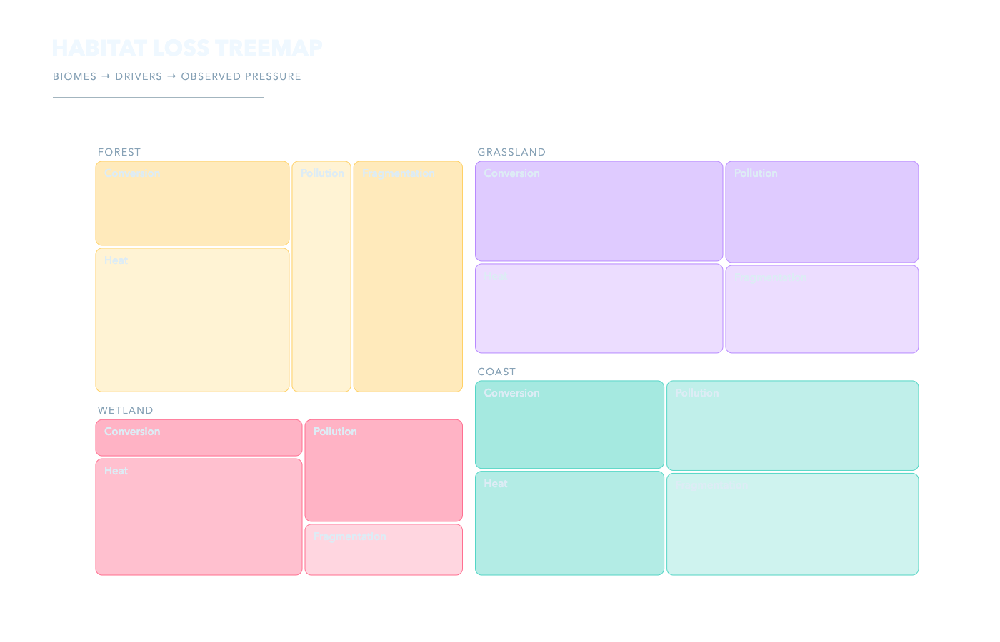
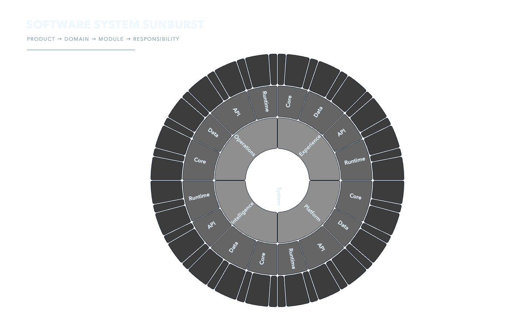
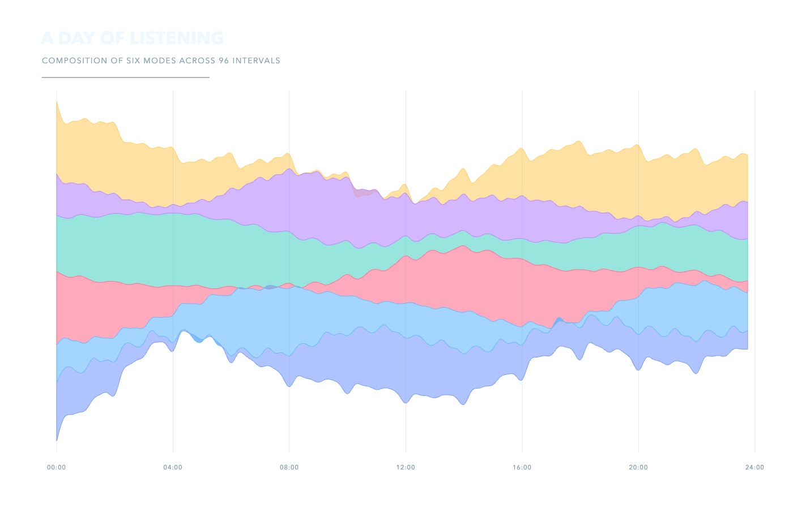
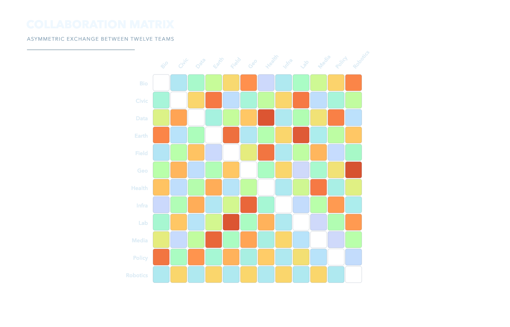
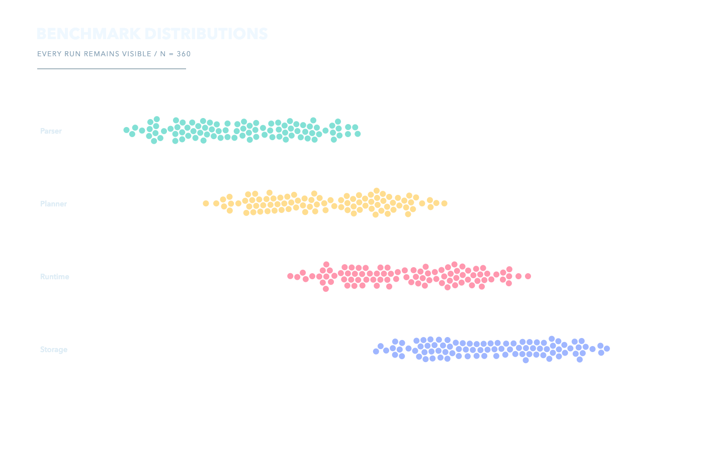
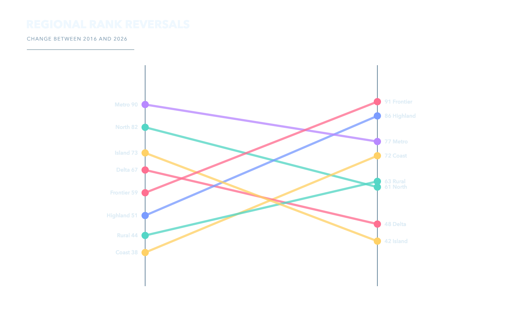
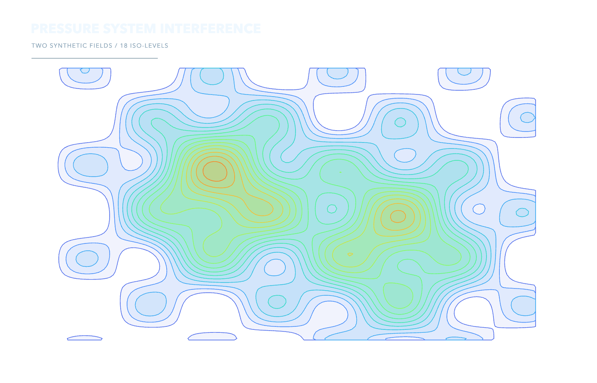
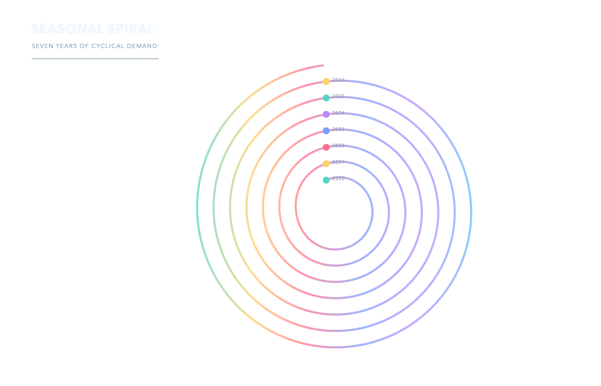

# D3 Visuals

D3 is used here as a geometry and layout toolkit across twelve distinct reference scenes, not as a preset chart catalog.

`catalog.json` records the use case, motivating question, visual family, complexity, and module tags.

| Chord | Radial tree | Voronoi | Force network |
|---|---|---|---|
|  |  |  |  |
| Treemap | Sunburst | Streamgraph | Matrix |
|  |  |  |  |
| Beeswarm | Slopegraph | Contours | Spiral |
|  |  |  |  |

`npm install && npm test` performs the full build, offline browser interaction, transparent export, and pixel acceptance pass.
